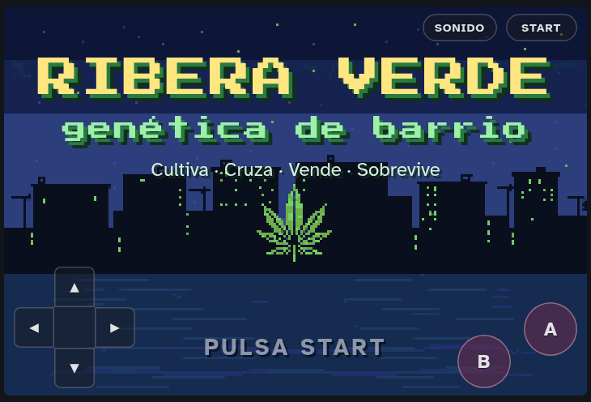
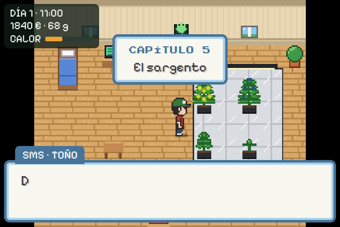
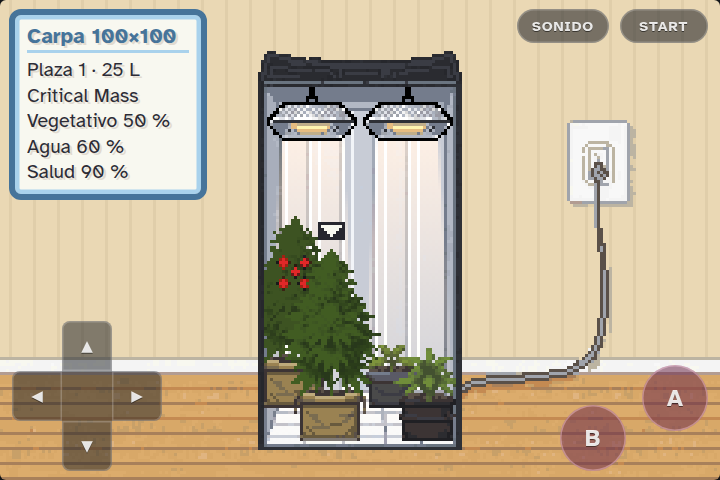
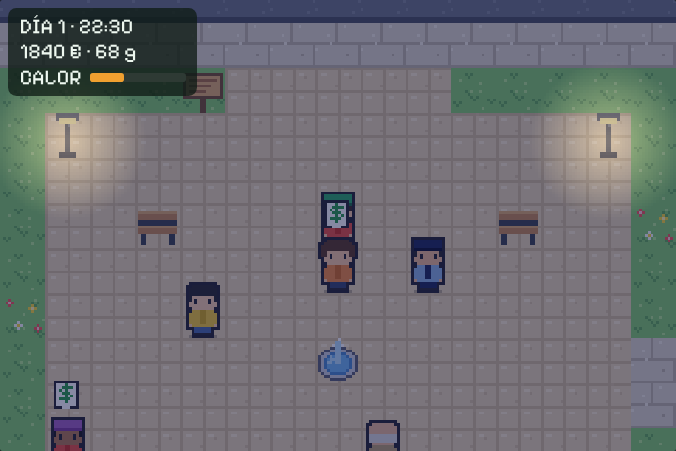
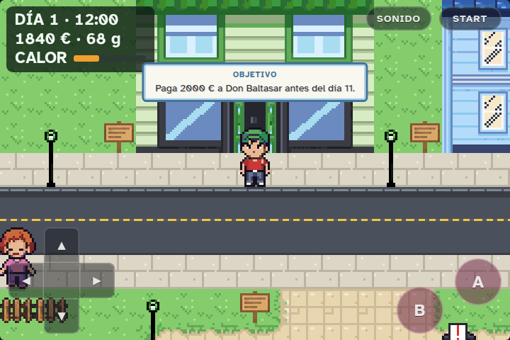
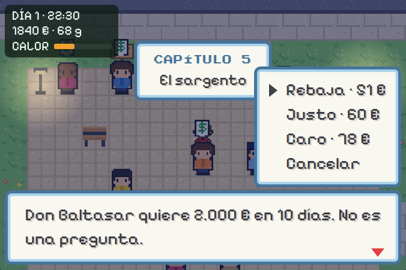
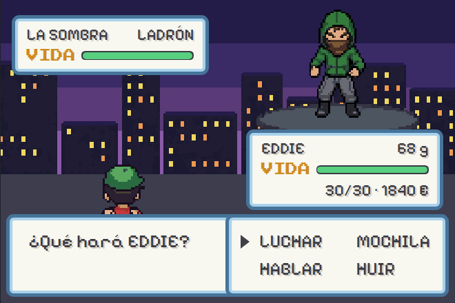
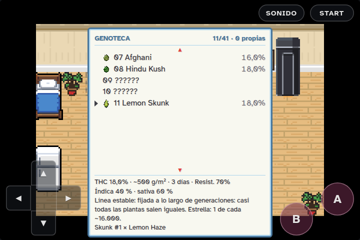
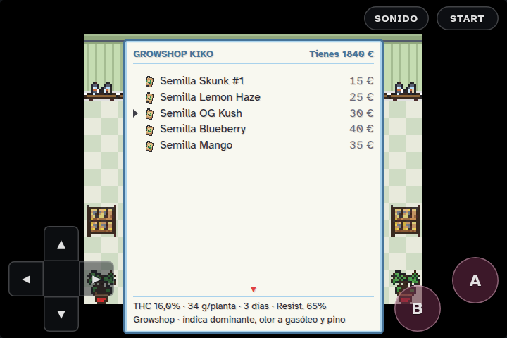

# Ribera Verde · genética de barrio

RPG de cultivo en pixel art, con 160 px de alto (y de 240 a 400 de ancho, según el móvil) al estilo de las portátiles de 16 bits. Variedades reales (Skunk #1, Afghani, Hindu Kush, Amnesia Haze…) y un guion serio. Toma las mecánicas de **Weed Firm**: cultivas en un armario, cruzas genéticas, vendes en la calle, esquivas a los ladrones y a la policía (o la sobornas) y sigues una historia de 7 capítulos para saldar la deuda que te dejó tu tía.



## Jugar

- Abre **`index.html`** con doble clic (Chrome, Edge o Firefox). Funciona sin conexión porque las fuentes van dentro del archivo.
- La partida se guarda en el navegador al dormir, al cambiar de capítulo y desde START → GUARDAR o desde el ordenador del piso. No se comparte entre navegadores ni entre equipos.
- Está pensado para el **móvil en horizontal**: la pantalla del juego ocupa todo el móvil (solo queda un reborde fino) y los mandos flotan encima, fijos: cruceta abajo a la izquierda, A y B abajo a la derecha, SONIDO y START arriba a la derecha. En móviles anchos el mundo se ve más ancho (hasta 400 px de juego) y los diálogos quedan en el centro, entre los mandos. En vertical aparece «Gira el móvil». Al primer toque pide pantalla completa y bloquea el giro en horizontal (el APK va siempre en horizontal).
- **Android (la app):** instala `dist/ribera-verde-godot.apk` (`npm run godot:apk`; «Ribera Verde», el juego hecho en Godot, sin conexión, sin permisos y sin anuncios). Pide confirmar la edad la primera vez; tiene OPCIONES (música, efectos, texto), CRÉDITOS con las licencias y la privacidad, y Atrás pone el juego en pausa. Lo que cumple de las normas de un juego para móvil, en `docs/NORMAS-MOVIL.md`; la ficha de Google Play, en `docs/PLAY.md`.
- **Android (versión web):** instala `dist/ribera-verde.apk` (activa «Instalar apps desconocidas» para el navegador o el gestor de archivos). Es el mismo juego en pantalla completa, sin conexión y sin permisos; el botón Atrás hace de B. La partida se guarda dentro de la app.

| Acción | Botón |
|---|---|
| Moverse | Cruceta |
| Hablar, usar, aceptar | A |
| Cancelar · mantener para correr | B |
| Menú (Genoteca, Mochila, Plantas, Objetivo, Guardar) | START |

En el PC también vale el teclado (flechas o WASD, Z/Espacio = A, X/Esc = B, M = START), aunque ya no se muestra en pantalla.

## Qué incluye

- **Cultivo:** carpas en el piso (armario de 60 u 80, carpa de 100 o 150 y carpa de 120: hasta 15 plantas); con A delante se abre la carpa en 3/4 y eliges planta o foco con la cruceta. Macetas de plástico o de tela de 7 a 25 L, focos CFL, sodio y LED de 100 a 720 W y extras (ventilador, filtro de carbón y goteo), con cifras reales: gramos por vatio, tope por litro de maceta, kWh y precios de growshop ([docs/ECONOMIA.md](docs/ECONOMIA.md)). Riego, abono, plagas y cinco fases de crecimiento. La cosecha da gramos con su % de THC y, a veces, semillas.
- **Genética:** mesa de cruces y Genoteca con 41 variedades reales, cada una con su historia: 6 del growshop, 16 landraces (una te la da Kiko, tres se consiguen por el barrio y doce, de Michoacán a Panama Red, se piden al banco de semillas del ordenador de la tía) y 19 que salen de cruces, de Haze y Northern Lights a la legendaria *Ghost Train Haze* (Amnesia Haze × Fire OG). Lo que sale de un cruce es una F1 de cosechas desiguales hasta que la estabilizas (F4). Los cruces sin receta generan híbridos propios. Cada semilla es una planta distinta: según la pureza de la genética, alguna sale **fenotipo estrella**, y con esquejes te la quedas.
- **Calle:** clientes con `$` (estudiante, currela, turista y pijo) a los que les pides precio de rebaja, justo o caro, y desde el capítulo 3, venta al por mayor a Iñaki. Cada venta sube el **calor policial** y a 90 llega una redada.
- **Combates por turnos:** contra ladrones (luchar, mochila, hablar, huir) y contra la policía (sobornar, hablar, huir, entregar).
- **Historia:** la herencia de la tía Maite, la deuda de 30.000 € con Don Baltasar, el sargento Molina, el rival Darko y la Copa de Ribera. Saldada la deuda, empieza tu imperio.
- Día y noche, chiptune propio y guardado local.

## Carpetas

```
index.html                    el juego completo (lo genera tools/build.js)
src/                          código fuente: shell.html + styles.css + js/ (16 módulos)
tools/                        build, test de la historia, generador de docs, capturas y tools/sprites (kit PixelLab)
docs/                         diseño, guion, genética, mapa, plano de escala (PLANO.md + plano/) y prompts de sprites
dist/ribera-verde.artifact.html   la misma página en formato Artifact de Claude
dist/ribera-verde.apk         el juego como app de Android (lo genera tools/build-apk.js)
assets/fonts/                 Atkinson Hyperlegible y Press Start 2P (woff2 + licencia OFL)
screenshots/                  14 capturas
art/                          manifiesto de sprites, inventario, referencias PNG y paleta (kit PixelLab)
CONTEXTO.md                   qué se pidió, qué se decidió y en qué estado está
CLAUDE.md                     notas para seguir el desarrollo con Claude Code
CHANGELOG.md                  versiones
```

## Desarrollo

Hace falta Node 18 o superior. Los comandos funcionan igual en `cmd` de Windows.

```
npm install
npx playwright install chromium
npm run build      # src/ → index.html y dist/ribera-verde.artifact.html
npm test           # compila y recorre la historia completa (52 pasos) en Chromium sin ventana
npm run docs       # compila y regenera docs/GENETICA.md, MAPA.md y ECONOMIA.md desde los datos del juego
npm run capturas   # compila y regenera screenshots/
npm run plano      # compila y regenera docs/plano/ (mapas con rejilla, hoja de escala y vista de carpa B)
npm run sprites:ref       # referencias PNG + paleta para PixelLab
npm run sprites:validar   # comprueba art/manifest.json
npm run sprites:procesar -- <grupo> [--atlas]   # salida de PixelLab → sprites listos
npm run sprites:catalogo  # catálogo de sprites por herramienta de PixelLab
npm run sprites:huellas   # huellas procedurales de las láminas de la vista B (init_image para PixelLab)
npm run test:arte         # prueba el motor de sprites con un atlas de calco
npm run apk               # compila y empaqueta dist/ribera-verde.apk (Java 17+; sin Android SDK)
```

Edita siempre en `src/` y después ejecuta `npm run build`. `index.html` y `dist/` se generan con el build y no se tocan a mano.

## Documentación

- [CONTEXTO.md](CONTEXTO.md): la petición, las decisiones, el estado y los siguientes pasos.
- [docs/GDD.md](docs/GDD.md): mecánicas, fórmulas y economía.
- [docs/GUION.md](docs/GUION.md): historia y diálogos por capítulo.
- [docs/GENETICA.md](docs/GENETICA.md): las 41 variedades, su historia y el árbol de cruces.
- [docs/MAPA.md](docs/MAPA.md): mapas con coordenadas, personajes, objetos y tienda.
- [docs/ECONOMIA.md](docs/ECONOMIA.md): focos, carpas, macetas, montajes de ejemplo, precios de venta, semillas, la deuda y el imperio, con las cifras reales del juego.
- [docs/PLAN-PRODUCCION.md](docs/PLAN-PRODUCCION.md): plan de lo que falta. Recoge el catálogo de carpas, focos, macetas y extras con sus medidas reales, la escala de cada vista, las láminas que hay que pedir a PixelLab con su coste y su orden, la historia y los desbloqueos por capítulo y las decisiones pendientes.
- [docs/PIXELLAB.md](docs/PIXELLAB.md): kit pro para cambiar todo el arte por sprites y animaciones de PixelLab con Claude Code (comando `/sprites`), sin salirse de la estética. El motor ya los usa en cuanto hay atlas.
- [docs/CATALOGO-SPRITES.md](docs/CATALOGO-SPRITES.md): cada sprite del juego con su herramienta de PixelLab (personajes, terreno, objetos sobre el mapa, lotes e imágenes), su orden y su coste.
- [CLAUDE.md](CLAUDE.md): arquitectura y partes delicadas del código.

## Capturas

| | |
|---|---|
|  |  |
|  |  |
|  |  |
|  |  |

## Créditos y licencias

- El código y todo el arte son originales. El atlas de PixelLab (`assets/sprites/`) va incrustado en el HTML y sustituye al dibujo por código donde lo cubre; las plantas de la vista de carpa salen del arte de cepas del propio repositorio (`../assets/plants`). Sin atlas, todo se dibuja por código.
- Las mecánicas se inspiran en *Weed Firm* y la estética en los RPG de portátil de 16 bits. No se usa ningún asset, personaje, nombre ni marca de esos juegos.
- Fuentes: [Atkinson Hyperlegible](https://fonts.google.com/specimen/Atkinson+Hyperlegible) (diálogos, menús y HUD, pensada para leerse bien) y [Press Start 2P](https://fonts.google.com/specimen/Press+Start+2P) (rótulos), ambas con licencia SIL Open Font License 1.1 (`assets/fonts/`).
