# Genética de Ribera Verde

> Generado automáticamente con `node tools/generar-docs.js` a partir de los datos del juego. No editar a mano: cambia `src/js/03-datos.js` y regenera.

## Las 23 variedades de la Genoteca

| # | Variedad | THC | Rinde (g/planta) | Días | Resist. | Color | Cómo se consigue |
|---|---|---|---|---|---|---|---|
| 01 | Skunk #1 | 12% | 40 | 2,5 | 75% | `#9bd35a` | Growshop (cap. 1) |
| 02 | Lemon Haze | 15% | 30 | 3,5 | 50% | `#d8e060` | Growshop (cap. 2) |
| 03 | OG Kush | 16% | 34 | 3 | 65% | `#6fb04a` | Growshop (cap. 2) |
| 04 | Blueberry | 17% | 32 | 3,5 | 55% | `#7a9ec8` | Growshop (cap. 3) |
| 05 | Mango | 15% | 45 | 3 | 60% | `#b8c850` | Growshop (cap. 3) |
| 06 | Purple Afghani | 18% | 28 | 4 | 45% | `#9070b8` | Growshop (cap. 4) |
| 07 | Afghani | 16% | 38 | 3 | 85% | `#88a050` | Kiko, al montar la mesa de genética: de un amigo de Mazar-i-Sharif (cap. 4) |
| 08 | Hindu Kush | 18% | 30 | 3 | 80% | `#4a8a3a` | Txaro, a cambio de 5 g para hacer aceite (parque): del viaje de su marido a Pakistán en 1976 |
| 09 | Acapulco Gold | 19% | 26 | 4,5 | 60% | `#d0c048` | En un bote de carrete escondido en un arbusto del parque (2,26), «Guerrero, 1979» |
| 10 | Malawi Gold | 20% | 24 | 5 | 55% | `#c8d068` | Iñaki, el marinero, tras venderle 10 g (muelle): de un marinero de Malaui en Mombasa |
| 11 | Lemon Skunk | 18% | 40 | 3 | 70% | `#c0dc50` | Cruce: Skunk #1 × Lemon Haze |
| 12 | Blueberry Kush | 20% | 36 | 3 | 65% | `#6a94b8` | Cruce: OG Kush × Blueberry |
| 13 | Trainwreck | 21% | 30 | 4 | 55% | `#a8cc58` | Cruce: Acapulco Gold × Afghani |
| 14 | Critical Mass | 21% | 40 | 3 | 85% | `#8cbc4c` | Cruce: Afghani × Skunk #1 |
| 15 | Purple Kush | 22% | 32 | 3,5 | 70% | `#7a5aa8` | Cruce: Hindu Kush × Purple Afghani |
| 16 | Mango Kush | 21% | 38 | 3,5 | 60% | `#a8c040` | Cruce: Mango × Hindu Kush |
| 17 | Blue Dream | 22% | 34 | 4 | 55% | `#80a8c0` | Cruce: Blueberry × Lemon Haze |
| 18 | Super Lemon Haze | 23% | 38 | 4 | 65% | `#d0e458` | Cruce: Lemon Skunk × Lemon Haze |
| 19 | Critical Kush | 24% | 42 | 3,5 | 80% | `#78ac44` | Cruce: Critical Mass × OG Kush |
| 20 | Purple Haze | 23% | 34 | 4 | 60% | `#8a64b0` | Cruce: Purple Kush × Lemon Haze |
| 21 | Amnesia Haze | 26% | 36 | 4,5 | 65% | `#bcd468` | Cruce: Super Lemon Haze × Trainwreck |
| 22 | Fire OG | 27% | 40 | 3,5 | 75% | `#90b448` | Cruce: Critical Kush × Blueberry Kush |
| 23 | Ghost Train Haze | 29% | 42 | 4,5 | 75% | `#d8ecb0` | Cruce: Amnesia Haze × Fire OG · **legendaria** |

## Recetas de cruce (13)

El orden de los padres da igual. Cada cruce gasta 1 semilla de cada padre y da 2 semillas del resultado.

| Madre | Padre | Resultado | THC |
|---|---|---|---|
| Lemon Haze | Skunk #1 | **Lemon Skunk** | 18% |
| Blueberry | OG Kush | **Blueberry Kush** | 20% |
| Acapulco Gold | Afghani | **Trainwreck** | 21% |
| Skunk #1 | Afghani | **Critical Mass** | 21% |
| Hindu Kush | Purple Afghani | **Purple Kush** | 22% |
| Hindu Kush | Mango | **Mango Kush** | 21% |
| Lemon Haze | Blueberry | **Blue Dream** | 22% |
| Lemon Skunk | Lemon Haze | **Super Lemon Haze** | 23% |
| Critical Mass | OG Kush | **Critical Kush** | 24% |
| Lemon Haze | Purple Kush | **Purple Haze** | 23% |
| Super Lemon Haze | Trainwreck | **Amnesia Haze** | 26% |
| Blueberry Kush | Critical Kush | **Fire OG** | 27% |
| Fire OG | Amnesia Haze | **Ghost Train Haze** | 29% |

## Árbol hasta la Ghost Train Haze

```mermaid
flowchart LR
  limon["Lemon Haze"] --> citrus["Lemon Skunk"]
  ria["Skunk #1"] --> citrus
  niebla["Blueberry"] --> bluetx["Blueberry Kush"]
  txoko["OG Kush"] --> bluetx
  acapulco["Acapulco Gold"] --> sollimon["Trainwreck"]
  rif["Afghani"] --> sollimon
  ria["Skunk #1"] --> kushrif["Critical Mass"]
  rif["Afghani"] --> kushrif
  hindu["Hindu Kush"] --> purpurah["Purple Kush"]
  purpura["Purple Afghani"] --> purpurah
  hindu["Hindu Kush"] --> orotrop["Mango Kush"]
  mango["Mango"] --> orotrop
  limon["Lemon Haze"] --> nieblamor["Blue Dream"]
  niebla["Blueberry"] --> nieblamor
  citrus["Lemon Skunk"] --> brumaog["Super Lemon Haze"]
  limon["Lemon Haze"] --> brumaog
  kushrif["Critical Mass"] --> reina["Critical Kush"]
  txoko["OG Kush"] --> reina
  limon["Lemon Haze"] --> amanecer["Purple Haze"]
  purpurah["Purple Kush"] --> amanecer
  brumaog["Super Lemon Haze"] --> tormenta["Amnesia Haze"]
  sollimon["Trainwreck"] --> tormenta
  bluetx["Blueberry Kush"] --> dragon["Fire OG"]
  reina["Critical Kush"] --> dragon
  dragon["Fire OG"] --> leyenda["Ghost Train Haze"]
  tormenta["Amnesia Haze"] --> leyenda
  style leyenda fill:#40e0a0,color:#062
```

## Híbridos propios (cruces sin receta)

Cualquier pareja que no esté en la tabla de recetas genera un híbrido «propio», determinista (la misma pareja da siempre el mismo resultado) y guardado en `S.custom`:

- **Nombre:** primera palabra de la madre + última palabra del padre (si coincide con un padre, al revés; si ya existe, se añade «F2…F8»).
- **THC:** media de los padres + aleatorio entre −1,5 y +2,0 (tope 33 %).
- **Rendimiento:** media ± 4 g. **Días:** media ± 0,3 (redondeado a medios días). **Resistencia:** media ± 5 (entre 20 y 95).
- **Color:** mezcla al 50 % de los colores de los padres.
- Aparecen en la Genoteca con ★ y cuentan para el objetivo de «descubrir 8 variedades».

## Fórmulas de cultivo

- **Crecimiento por hora:** `1 / (días × 24) × crec`, ×0,4 si el agua < 20 %, 0 si el agua llega a 0, ×1,1 con abono. `crec`, `rend`, `thc` y `riego` salen del foco y de la maceta de cada plaza (ver la sección 4 del [GDD](GDD.md)).
- **Agua:** baja 3,5 × riego puntos por hora (con CFL y maceta de 7 L una planta regada aguanta ~28 h).
- **Salud:** −4/h sin agua, −2,5/h con plaga, +1/h si agua > 30 % y sin plaga. A 0 la planta muere.
- **Plagas:** probabilidad por hora `0,006 × (100 − resistencia) / 40` mientras no está madura.
- **Cosecha (g):** `rinde × (0,4 + 0,6 × salud/100) × (abono ? 1,25 : 1) × rend`.
- **THC final:** `THC × (0,85 + 0,15 × salud/100) + thc + (abono ? 0,3 : 0)`.
- **Semillas al cosechar:** 1 + (0 a 2).
