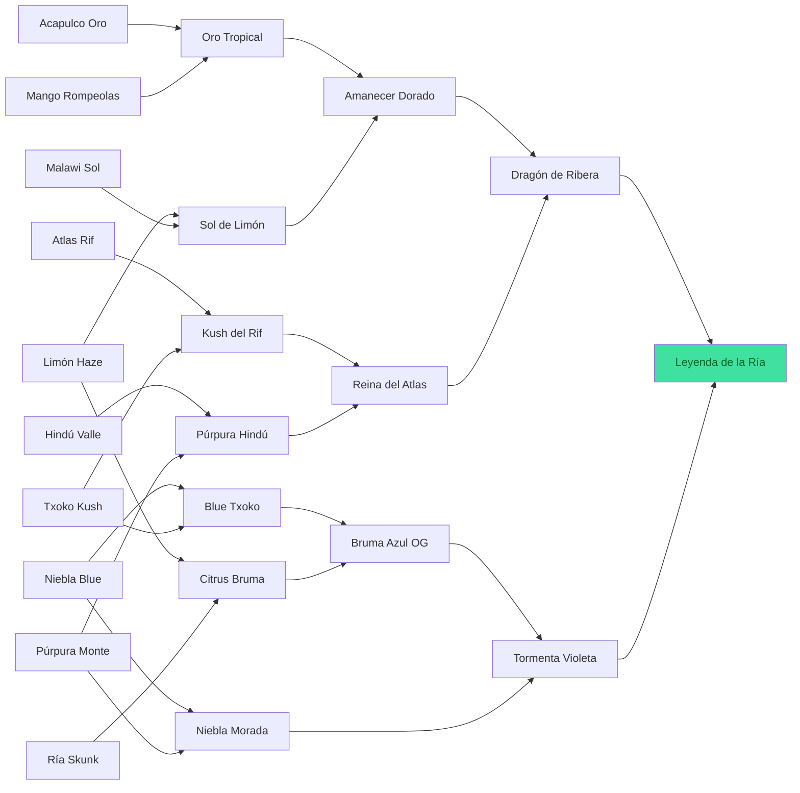

# Genética de Ribera Verde

> Generado automáticamente con `node tools/generar-docs.js` a partir de los datos del juego. No editar a mano: cambia `src/js/03-datos.js` y regenera.

## Las 23 variedades de la Genoteca

| # | Variedad | THC | Rinde (g/planta) | Días | Resist. | Color | Cómo se consigue |
|---|---|---|---|---|---|---|---|
| 01 | Ría Skunk | 12% | 40 | 2,5 | 75% | `#9bd35a` | Growshop (cap. 1) |
| 02 | Limón Haze | 15% | 30 | 3,5 | 50% | `#e8e05a` | Growshop (cap. 2) |
| 03 | Txoko Kush | 16% | 34 | 3 | 65% | `#6fb04a` | Growshop (cap. 2) |
| 04 | Niebla Blue | 17% | 32 | 3,5 | 55% | `#7aa6e0` | Growshop (cap. 3) |
| 05 | Mango Rompeolas | 15% | 45 | 3 | 60% | `#f0a048` | Growshop (cap. 3) |
| 06 | Púrpura Monte | 18% | 28 | 4 | 45% | `#a070d0` | Growshop (cap. 4) |
| 07 | Atlas Rif | 16% | 38 | 3 | 85% | `#c8b070` | Regalo de Kiko al abrir la mesa de genética (cap. 4) |
| 08 | Hindú Valle | 18% | 30 | 3 | 80% | `#4a8a3a` | Abuela Txaro, a cambio de 5 g (parque) |
| 09 | Acapulco Oro | 19% | 26 | 4,5 | 60% | `#f0c838` | Escondida en un arbusto del parque (2,26) |
| 10 | Malawi Sol | 20% | 24 | 5 | 55% | `#d8e070` | Iñaki, el marinero, tras venderle 10 g (muelle) |
| 11 | Citrus Bruma | 18% | 40 | 3 | 70% | `#c8e050` | Cruce: Ría Skunk × Limón Haze |
| 12 | Blue Txoko | 20% | 36 | 3 | 65% | `#5a90c8` | Cruce: Txoko Kush × Niebla Blue |
| 13 | Sol de Limón | 21% | 30 | 4 | 55% | `#f0e878` | Cruce: Limón Haze × Malawi Sol |
| 14 | Kush del Rif | 21% | 40 | 3 | 85% | `#a8a050` | Cruce: Atlas Rif × Txoko Kush |
| 15 | Púrpura Hindú | 22% | 32 | 3,5 | 70% | `#8050b0` | Cruce: Hindú Valle × Púrpura Monte |
| 16 | Oro Tropical | 21% | 38 | 3,5 | 60% | `#f8b030` | Cruce: Acapulco Oro × Mango Rompeolas |
| 17 | Niebla Morada | 22% | 30 | 4 | 55% | `#9080e0` | Cruce: Niebla Blue × Púrpura Monte |
| 18 | Bruma Azul OG | 23% | 40 | 3 | 70% | `#70b0b0` | Cruce: Citrus Bruma × Blue Txoko |
| 19 | Reina del Atlas | 25% | 38 | 3,5 | 80% | `#b060a0` | Cruce: Kush del Rif × Púrpura Hindú |
| 20 | Amanecer Dorado | 24% | 36 | 3,5 | 60% | `#f8d050` | Cruce: Sol de Limón × Oro Tropical |
| 21 | Tormenta Violeta | 26% | 36 | 3,5 | 65% | `#7058d0` | Cruce: Niebla Morada × Bruma Azul OG |
| 22 | Dragón de Ribera | 27% | 42 | 3,5 | 75% | `#e05050` | Cruce: Reina del Atlas × Amanecer Dorado |
| 23 | Leyenda de la Ría | 31% | 45 | 4 | 80% | `#40e0a0` | Cruce: Tormenta Violeta × Dragón de Ribera · **legendaria** |

## Recetas de cruce (13)

El orden de los padres da igual. Cada cruce gasta 1 semilla de cada padre y da 2 semillas del resultado.

| Madre | Padre | Resultado | THC |
|---|---|---|---|
| Limón Haze | Ría Skunk | **Citrus Bruma** | 18% |
| Niebla Blue | Txoko Kush | **Blue Txoko** | 20% |
| Limón Haze | Malawi Sol | **Sol de Limón** | 21% |
| Atlas Rif | Txoko Kush | **Kush del Rif** | 21% |
| Hindú Valle | Púrpura Monte | **Púrpura Hindú** | 22% |
| Acapulco Oro | Mango Rompeolas | **Oro Tropical** | 21% |
| Niebla Blue | Púrpura Monte | **Niebla Morada** | 22% |
| Blue Txoko | Citrus Bruma | **Bruma Azul OG** | 23% |
| Kush del Rif | Púrpura Hindú | **Reina del Atlas** | 25% |
| Oro Tropical | Sol de Limón | **Amanecer Dorado** | 24% |
| Bruma Azul OG | Niebla Morada | **Tormenta Violeta** | 26% |
| Amanecer Dorado | Reina del Atlas | **Dragón de Ribera** | 27% |
| Dragón de Ribera | Tormenta Violeta | **Leyenda de la Ría** | 31% |

## Árbol hasta la Leyenda

## Híbridos propios (cruces sin receta)

Cualquier pareja que no esté en la tabla de recetas genera un híbrido «propio», determinista (la misma pareja da siempre el mismo resultado) y guardado en `S.custom`:

- **Nombre:** primera palabra de la madre + última palabra del padre (si coincide con un padre, al revés; si ya existe, se añade «F2…F8»).
- **THC:** media de los padres + aleatorio entre −1,5 y +2,0 (tope 33 %).
- **Rendimiento:** media ± 4 g. **Días:** media ± 0,3 (redondeado a medios días). **Resistencia:** media ± 5 (entre 20 y 95).
- **Color:** mezcla al 50 % de los colores de los padres.
- Aparecen en la Genoteca con ★ y cuentan para el objetivo de «descubrir 8 variedades».

## Fórmulas de cultivo

- **Crecimiento por hora:** `1 / (días × 24) × crec`, ×0,4 si el agua < 20 %, 0 si el agua llega a 0, ×1,1 con abono. `crec`, `rend`, `thc` y `riego` salen del foco y de la maceta de cada plaza (ver la sección 4 del [GDD](GDD.md)).
- **Agua:** baja 3,5 × riego puntos por hora (con CFL y maceta de 7 L una planta regada aguanta ~28 h).
- **Salud:** −4/h sin agua, −2,5/h con plaga, +1/h si agua > 30 % y sin plaga. A 0 la planta muere.
- **Plagas:** probabilidad por hora `0,006 × (100 − resistencia) / 40` mientras no está madura.
- **Cosecha (g):** `rinde × (0,4 + 0,6 × salud/100) × (abono ? 1,25 : 1) × rend`.
- **THC final:** `THC × (0,85 + 0,15 × salud/100) + thc + (abono ? 0,3 : 0)`.
- **Semillas al cosechar:** 1 + (0 a 2).
