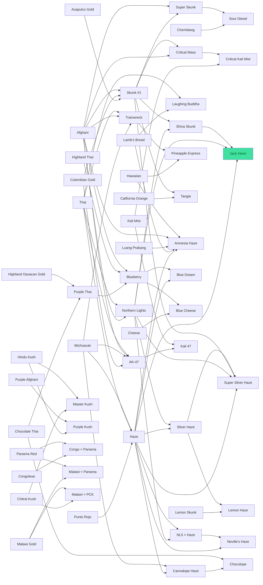

# Genética de Ribera Verde

> Generado automáticamente con `node tools/generar-docs.js` a partir de los datos del juego. No editar a mano: cambia `src/js/03-datos.js` y regenera.

## Las 59 variedades de la Genoteca

| # | Variedad | THC | Rinde (g/m²) | Días | Resist. | Índica | Tipo | Cogollo | Hoja | Cómo se consigue |
|---|---|---|---|---|---|---|---|---|---|---|
| 01 | Skunk #1 | 12% | 500 | 2,5 | 75% | 65 % | línea estable | `#9bd35a` | `#57a33e` | Growshop (cap. 1), 5 € la semilla |
| 02 | Lemon Haze | 15% | 380 | 3,5 | 50% | 20 % | polihíbrido | `#d8e060` | `#7aa63e` | Growshop (cap. 2), 9 € la semilla |
| 03 | Super Skunk | 19% | 580 | 2,5 | 85% | 80 % | cruce F1 | `#6fb04a` | `#50973b` | Growshop (cap. 2), 10 € la semilla |
| 04 | Blueberry | 17% | 400 | 3,5 | 55% | 80 % | línea estable | `#7a9ec8` | `#4a8a4c` | Growshop (cap. 3), 8 € la semilla |
| 05 | Big Bud | 17% | 630 | 3 | 75% | 85 % | línea estable | `#b8c850` | `#4f9a3c` | Growshop (cap. 3), 7 € la semilla |
| 06 | Purple Afghani | 18% | 350 | 4 | 45% | 95 % | línea estable | `#9070b8` | `#4c6c44` | Growshop (cap. 4), 8 € la semilla |
| 07 | Lemon Skunk | 18% | 500 | 3 | 70% | 40 % | línea estable | `#c0dc50` | `#6ba53e` | Growshop (cap. 3), 8 € la semilla |
| 08 | Kali Mist | 18% | 380 | 4 | 60% | 10 % | línea estable | `#c4d878` | `#82a73e` | Growshop (cap. 4), 10 € la semilla |
| 09 | Cheese | 17% | 500 | 2,5 | 75% | 60 % | línea estable | `#b4c868` | `#5ba33e` | Growshop (cap. 3), 9 € la semilla |
| 10 | California Orange | 16% | 450 | 3 | 70% | 40 % | línea estable | `#d8b850` | `#6ba53e` | Growshop (cap. 4), 8 € la semilla |
| 11 | Chemdawg | 22% | 430 | 3,5 | 60% | 45 % | polihíbrido | `#8cb050` | `#67a53e` | Growshop (cap. 5), 12 € la semilla |
| 12 | Afghani | 16% | 480 | 3 | 85% | 100 % | landrace | `#88a050` | `#3f7a34` | Kiko, al montar la mesa de genética: de un amigo de Mazar-i-Sharif (cap. 4) |
| 13 | Hindu Kush | 18% | 380 | 3 | 80% | 100 % | landrace | `#4a8a3a` | `#3f7a34` | Txaro, a cambio de 5 g para hacer aceite (parque): del viaje de su marido a Pakistán en 1976 |
| 14 | Acapulco Gold | 19% | 330 | 4,5 | 60% | 0 % | landrace | `#d0c048` | `#8aa83e` | En un bote de carrete escondido en un arbusto del parque (2,26), «Guerrero, 1979» |
| 15 | Malawi Gold | 20% | 300 | 5 | 55% | 0 % | landrace | `#c8d068` | `#8aa83e` | Iñaki, el marinero, tras venderle 10 g (muelle): de un marinero de Malaui en Mombasa |
| 16 | Michoacán | 15% | 380 | 4 | 55% | 0 % | landrace | `#b8d860` | `#8aa83e` | Banco de semillas del PC, sobre de 10 por 25 € (cap. 2; llega al día siguiente) |
| 17 | Punto Rojo | 16% | 380 | 4,5 | 45% | 0 % | landrace | `#b4a24c` | `#8aa83e` | Banco de semillas del PC, sobre de 10 por 30 € (cap. 2; llega al día siguiente) |
| 18 | Colombian Gold | 16% | 380 | 4,5 | 55% | 0 % | landrace | `#ccc050` | `#8aa83e` | Banco de semillas del PC, sobre de 10 por 30 € (cap. 2; llega al día siguiente) |
| 19 | Thai | 17% | 330 | 5 | 40% | 0 % | landrace | `#b0d468` | `#8aa83e` | Banco de semillas del PC, sobre de 10 por 30 € (cap. 2; llega al día siguiente) |
| 20 | Chocolate Thai | 16% | 300 | 5 | 40% | 0 % | landrace | `#9a8a50` | `#8aa83e` | Banco de semillas del PC, sobre de 10 por 35 € (cap. 3; llega al día siguiente) |
| 21 | Highland Thai | 15% | 330 | 4,5 | 50% | 10 % | landrace | `#a8c870` | `#82a73e` | Banco de semillas del PC, sobre de 10 por 30 € (cap. 3; llega al día siguiente) |
| 22 | Luang Prabang | 15% | 380 | 4,5 | 50% | 0 % | landrace | `#8a9a5c` | `#8aa83e` | Banco de semillas del PC, sobre de 10 por 40 € (cap. 4; llega al día siguiente) |
| 23 | Chitral Kush | 17% | 400 | 3 | 70% | 100 % | landrace | `#7a9a48` | `#4a6e3c` | Banco de semillas del PC, sobre de 10 por 35 € (cap. 3; llega al día siguiente) |
| 24 | Nepalese | 16% | 350 | 3,5 | 65% | 50 % | landrace | `#88906a` | `#63a43e` | Banco de semillas del PC, sobre de 10 por 30 € (cap. 3; llega al día siguiente) |
| 25 | Congolese | 16% | 400 | 3,5 | 55% | 0 % | landrace | `#b4d058` | `#8aa83e` | Banco de semillas del PC, sobre de 10 por 30 € (cap. 3; llega al día siguiente) |
| 26 | Lamb's Bread | 16% | 380 | 4 | 60% | 0 % | landrace | `#a8d070` | `#8aa83e` | Banco de semillas del PC, sobre de 10 por 30 € (cap. 3; llega al día siguiente) |
| 27 | Hawaiian | 15% | 380 | 4 | 55% | 20 % | landrace | `#b8d870` | `#7aa63e` | Banco de semillas del PC, sobre de 10 por 30 € (cap. 3; llega al día siguiente) |
| 28 | Kif | 13% | 350 | 3 | 80% | 80 % | landrace | `#a8c060` | `#4d913a` | Banco de semillas del PC, sobre de 10 por 20 € (cap. 2; llega al día siguiente) |
| 29 | Beldia | 12% | 300 | 3 | 75% | 80 % | landrace | `#98b45c` | `#4d913a` | Banco de semillas del PC, sobre de 10 por 20 € (cap. 2; llega al día siguiente) |
| 30 | Highland Oaxacan Gold | 15% | 400 | 4 | 65% | 0 % | landrace | `#b0a84a` | `#8aa83e` | Banco de semillas del PC, sobre de 10 por 25 € (cap. 3; llega al día siguiente) |
| 31 | Panama Red | 17% | 350 | 4,5 | 50% | 0 % | landrace | `#b8984c` | `#8aa83e` | Banco de semillas del PC, sobre de 10 por 45 € (cap. 4; llega al día siguiente) |
| 32 | Haze | 20% | 400 | 5 | 45% | 10 % | cruce (F1 en la mesa) | `#c8dc68` | `#82a73e` | Cruce: Colombia × México × Tailandia (quizá India del Sur) · ≈ origen incierto |
| 33 | Northern Lights | 18% | 530 | 3 | 80% | 90 % | cruce (F1 en la mesa) | `#7cae4c` | `#468637` | Cruce: Afghani, con algo de Thai · ≈ origen incierto |
| 34 | Purple Thai | 18% | 350 | 4,5 | 50% | 10 % | cruce (F1 en la mesa) | `#9a74b8` | `#82a73e` | Cruce: Chocolate Thai × Highland Oaxacan Gold |
| 35 | Trainwreck | 21% | 380 | 4 | 55% | 35 % | cruce (F1 en la mesa) | `#a8cc58` | `#6fa53e` | Cruce: Mexicana × Thai × Afghani · ≈ origen incierto |
| 36 | AK-47 | 20% | 500 | 3 | 75% | 35 % | cruce (F1 en la mesa) | `#a0c858` | `#6fa53e` | Cruce: Colombiana × mexicana × thai × afgana (1992) |
| 37 | Laughing Buddha | 19% | 400 | 4 | 55% | 20 % | cruce (F1 en la mesa) | `#bcd870` | `#7aa63e` | Cruce: Thai × Jamaicana |
| 38 | Cannalope Haze | 20% | 380 | 3,5 | 55% | 10 % | cruce (F1 en la mesa) | `#d0d878` | `#82a73e` | Cruce: Haze × Michoacán |
| 39 | Master Kush | 20% | 480 | 3 | 85% | 100 % | cruce (F1 en la mesa) | `#6e9a44` | `#3f7a34` | Cruce: dos landraces del Hindu Kush · ≈ origen incierto |
| 40 | Purple Kush | 22% | 400 | 3,5 | 70% | 100 % | cruce (F1 en la mesa) | `#7a5aa8` | `#486640` | Cruce: Hindu Kush × Purple Afghani · ≈ origen incierto |
| 41 | Congo × Panama | 18% | 350 | 4,5 | 50% | 0 % | cruce (F1 en la mesa) | `#b8c058` | `#8aa83e` | Cruce: Congolese × Panama Red |
| 42 | Malawi × Panama | 20% | 330 | 5 | 50% | 0 % | cruce (F1 en la mesa) | `#c4b860` | `#8aa83e` | Cruce: Malawi Gold × Panama Red |
| 43 | Malawi × PCK | 19% | 400 | 4 | 60% | 40 % | cruce (F1 en la mesa) | `#a8b858` | `#6ba53e` | Cruce: Malawi Gold × Chitral Kush (PCK) |
| 44 | Critical Mass | 21% | 500 | 3 | 85% | 80 % | cruce (F1 en la mesa) | `#8cbc4c` | `#4d913a` | Cruce: Afghani × Skunk #1 |
| 45 | Shiva Skunk | 19% | 550 | 3 | 85% | 80 % | cruce (F1 en la mesa) | `#8cbc50` | `#4d913a` | Cruce: Skunk #1 × Northern Lights |
| 46 | NL5 × Haze | 21% | 430 | 4 | 60% | 40 % | cruce (F1 en la mesa) | `#b0cc68` | `#6ba53e` | Cruce: Northern Lights × Haze |
| 47 | Neville's Haze | 22% | 380 | 4,5 | 50% | 10 % | cruce (F1 en la mesa) | `#c8dc80` | `#82a73e` | Cruce: Haze × (NL5 × Haze) |
| 48 | Silver Haze | 21% | 450 | 4,5 | 55% | 35 % | cruce (F1 en la mesa) | `#c0d880` | `#6fa53e` | Cruce: Haze × Northern Lights · ≈ origen incierto |
| 49 | Chocolope | 21% | 400 | 4 | 55% | 10 % | cruce (F1 en la mesa) | `#a89c58` | `#82a73e` | Cruce: Chocolate Thai × Cannalope Haze |
| 50 | Pineapple Express | 21% | 480 | 3,5 | 60% | 40 % | cruce (F1 en la mesa) | `#c8d050` | `#6ba53e` | Cruce: Trainwreck × Hawaiian · ≈ origen incierto |
| 51 | Tangie | 20% | 450 | 3,5 | 60% | 30 % | cruce (F1 en la mesa) | `#e0b848` | `#72a63e` | Cruce: California Orange × Skunk #1 |
| 52 | Amnesia Haze | 26% | 450 | 4,5 | 65% | 20 % | cruce (F1 en la mesa) | `#bcd468` | `#7aa63e` | Cruce: Haze + jamaicana + afgana o hawaiana + Laos · ≈ origen incierto |
| 53 | Jack Herer | 28% | 500 | 3,5 | 70% | 45 % | cruce (F1 en la mesa) | `#d8ecb0` | `#6ba53e` | Cruce: Haze × (NL5 × Shiva Skunk) · **legendaria** |
| 54 | Super Silver Haze | 23% | 500 | 4 | 70% | 20 % | cruce (F1 en la mesa) | `#c8e090` | `#7aa63e` | Cruce: Skunk #1 × Northern Lights × Haze |
| 55 | Blue Dream | 22% | 430 | 4 | 55% | 40 % | cruce (F1 en la mesa) | `#80a8c0` | `#5c9a48` | Cruce: Blueberry × Haze |
| 56 | Blue Cheese | 19% | 500 | 3 | 70% | 75 % | cruce (F1 en la mesa) | `#6a94b8` | `#468650` | Cruce: Blueberry × Cheese |
| 57 | Sour Diesel | 27% | 450 | 4 | 60% | 30 % | cruce (F1 en la mesa) | `#90b448` | `#6fa53e` | Cruce: Chemdawg × Super Skunk · ≈ origen incierto |
| 58 | Kali 47 | 21% | 450 | 3,5 | 65% | 30 % | cruce (F1 en la mesa) | `#b0cc68` | `#72a63e` | Cruce: Kali Mist × AK-47 |
| 59 | Critical Kali Mist | 21% | 530 | 3,5 | 75% | 45 % | cruce (F1 en la mesa) | `#98c058` | `#5c9a48` | Cruce: Critical Mass × Kali Mist |

**Índica** es el % índica (el resto, sativa), con datos reales de cada variedad; **hoja**, el tono de su hoja. Dan la forma de la planta en la carpa (`porteInd`): 70 % o más, índica (hoja ancha de 7 foliolos, colas gordas y cortas, internudo corto); menos de 30 %, sativa (9 foliolos finos y largos, colas finas y largas, internudo largo); en medio, híbrida. La sativa tiene la hoja clara y amarillenta; la índica, oscura.

## Historia de cada variedad

Las landraces y los híbridos clásicos de la 1.9 salen del catálogo de Strainmon (`../src/species.js`): mismas regiones y perfiles, con su nombre real. Se lee en la Genoteca.

| Variedad | Origen | Historia |
|---|---|---|
| Skunk #1 | Afghani × Colombian Gold × Acapulco Gold | Fijada a finales de los setenta con tres landraces: robusta, estable y fácil. Es la base de media genética moderna. |
| Lemon Haze | Lemon Skunk × Silver Haze · ≈ origen incierto | Sativa cítrica de floración lenta. Su linaje exacto no está publicado. |
| Super Skunk | Skunk #1 × Afghani | La Skunk #1 vuelta a cruzar con Afghani: más índica, más rápida y más olorosa. |
| Blueberry | Purple Thai × Highland Thai × Afghani | Índica afrutada de los setenta; con frío de noche azulea. |
| Big Bud | base Afghani · ≈ origen incierto | Famosa por el tamaño de sus cogollos. Sus padres exactos no se conocen. |
| Purple Afghani | Landrace · Afganistán, selección morada | Índica delicada de montaña que se vuelve morada al final. |
| Lemon Skunk | Selección cítrica de Skunk #1 | Dos plantas de Skunk #1 con olor a limón, cruzadas entre sí hasta fijarlo. |
| Kali Mist | sativa asiática · ≈ origen incierto (padres sin publicar) | Sativa de floración larga y efecto claro. Nunca se publicaron sus padres. |
| Cheese | Fenotipo de Skunk #1 (Reino Unido) | Una planta de Skunk #1 con olor a queso curado, guardada por esquejes durante años. |
| California Orange | Híbrido de California de los setenta | Planta de aroma a naranja, conservada en California desde los setenta. |
| Chemdawg | Híbrido de los noventa · ≈ origen incierto | Olor químico, a gasóleo. Salió de unas semillas sin papeles a principios de los noventa. |
| Michoacán | Landrace · altiplano de Michoacán, México | Sativa de altura, espigada y cerebral. Aguanta bien el sol fuerte. |
| Punto Rojo | Landrace · cordillera de Colombia | Sativa colombiana de pistilos rojizos. Floración larga y efecto eufórico. |
| Colombian Gold | Landrace · sierra de Santa Marta, Colombia | La sativa dorada de la costa colombiana. Una de las tres madres de la Skunk #1. |
| Thai | Landrace · selvas del norte de Tailandia | Sativa esbelta, de floración larguísima y aroma especiado. Es madre de la Haze y de la Northern Lights. |
| Chocolate Thai | Landrace · Tailandia | Sativa tailandesa de cogollo oscuro y aroma a cacao. Llegaba a Occidente atada en palitos. |
| Highland Thai | Landrace · montañas del norte de Tailandia | La Thai de altura: algo más corta y fresca que la de la selva. |
| Luang Prabang | Landrace · montes del norte de Laos | Sativa de las tierras altas de Laos. Muy vigorosa, con aroma dulce y a madera. |
| Chitral Kush | Landrace · valle de Chitral, Pakistán | Índica de charas: su resina se frota a mano. Puede salir con tonos morados. |
| Nepalese | Landrace · colinas del Himalaya, Nepal | Planta de altura, compacta y resinosa, con aroma a incienso. |
| Congolese | Landrace · cuenca del Congo | Sativa africana rápida para su tipo. Efecto claro y aroma a fruta ácida. |
| Lamb's Bread | Landrace · costa de Jamaica | Sativa caribeña que tolera la brisa salina. Aroma dulce, tropical y marino. |
| Hawaiian | Landrace · islas de Hawái | Sativa de isla, de aroma a fruta tropical. Crece en suelo volcánico. |
| Kif | Landrace · montañas del Rif, Marruecos | La planta del hachís marroquí: seca, compacta y cargada de tricomas. |
| Beldia | Landrace · Ketama, en el Rif | La vieja landrace del Rif, casi desplazada por los híbridos. Rústica y aromática. |
| Highland Oaxacan Gold | Landrace · sierra de Oaxaca, México | Sativa de altura y suelo volcánico, vigorosa, con aroma ahumado y terroso. |
| Panama Red | Landrace · istmo de Panamá | La sativa legendaria de los setenta, veteada de rojo. Muy cerebral y de floración lenta. |
| Haze | Colombia × México × Tailandia (quizá India del Sur) · ≈ origen incierto | Se fijó en California en los años setenta con sativas de Colombia, México y Tailandia. Se cruza Punto Rojo o Michoacán con Thai. |
| Northern Lights | Afghani, con algo de Thai · ≈ origen incierto | Índica compacta y muy resinosa, fijada en los ochenta. En la mesa: Afghani × Thai. |
| Purple Thai | Chocolate Thai × Highland Oaxacan Gold | Sativa morada de los setenta. Es la abuela de la Blueberry. |
| Trainwreck | Mexicana × Thai × Afghani · ≈ origen incierto | Una de las primeras grandes de California. En la mesa: Michoacán, Thai y Afghani. |
| AK-47 | Colombiana × mexicana × thai × afgana (1992) | Cuatro landraces en una: rápida para ser tan sativa y muy fácil de cultivar. |
| Laughing Buddha | Thai × Jamaicana | Sativa alegre de Thai y Lamb's Bread. Aroma dulce y especiado. |
| Cannalope Haze | Haze × Michoacán | Una Haze más rápida, con aroma a melón. |
| Master Kush | dos landraces del Hindu Kush · ≈ origen incierto | Dos índicas de la cordillera juntas: compacta, resinosa y de floración corta. En la mesa: Hindu Kush × Chitral Kush. |
| Purple Kush | Hindu Kush × Purple Afghani · ≈ origen incierto | Índica pura morada, de efecto pesado. |
| Congo × Panama | Congolese × Panama Red | Dos sativas legendarias: la rapidez africana con el efecto de la Panama Red. |
| Malawi × Panama | Malawi Gold × Panama Red | Sativa pura de floración larguísima y efecto muy potente. |
| Malawi × PCK | Malawi Gold × Chitral Kush (PCK) | La Malawi domada con la índica de Chitral: florece antes y produce más. |
| Critical Mass | Afghani × Skunk #1 | La madre es la Afghani: cogollos tan gordos que hay que sujetarlos. |
| Shiva Skunk | Skunk #1 × Northern Lights | Northern Lights con Skunk #1: robusta, rápida y muy productiva. |
| NL5 × Haze | Northern Lights × Haze | La madre es la Northern Lights: la Haze con más cogollo y algo más rápida. |
| Neville's Haze | Haze × (NL5 × Haze) | Tres cuartos de Haze: de las sativas más potentes y lentas que hay. |
| Silver Haze | Haze × Northern Lights · ≈ origen incierto | La madre es la Haze: conserva el efecto y acorta la floración. |
| Chocolope | Chocolate Thai × Cannalope Haze | Sativa con aroma a cacao y café. |
| Pineapple Express | Trainwreck × Hawaiian · ≈ origen incierto | Trainwreck con una sativa de Hawái: aroma a piña. |
| Tangie | California Orange × Skunk #1 | La California Orange con Skunk #1: huele a mandarina. |
| Amnesia Haze | Haze + jamaicana + afgana o hawaiana + Laos · ≈ origen incierto | Haze con Lamb's Bread, Luang Prabang y una índica (Afghani o Hawaiian). Muy potente. |
| Jack Herer | Haze × (NL5 × Shiva Skunk) · LEGENDARIA | Haze, Northern Lights y Shiva Skunk en una sola línea. Premiada como pocas en los noventa. |
| Super Silver Haze | Skunk #1 × Northern Lights × Haze | Haze, Northern Lights y Skunk #1 en una sola línea. Una de las sativas más premiadas de los noventa. |
| Blue Dream | Blueberry × Haze | La Blueberry con una Haze: dulce y equilibrada. |
| Blue Cheese | Blueberry × Cheese | La Cheese con el dulzor de la Blueberry. |
| Sour Diesel | Chemdawg × Super Skunk · ≈ origen incierto | Olor a gasóleo agrio y efecto rápido. Una de las más buscadas. |
| Kali 47 | Kali Mist × AK-47 | La Kali Mist con la AK-47: sativa más rápida y productiva. |
| Critical Kali Mist | Critical Mass × Kali Mist | La producción de la Critical Mass con el efecto de la Kali Mist. |

## El árbol por generaciones (1.11)

Los híbridos clásicos, de las landraces a la 3.ª generación. ✔ padres documentados; ≈ origen incierto (se marca en la Genoteca).

| Gen. | Variedad | Padres | | THC | Índica |
|---|---|---|---|---|---|
| 1.ª | Skunk #1 | Afghani × Colombian Gold × Acapulco Gold | ✔ | 12% | 65 % |
| 1.ª | Kali Mist | sativa asiática | ≈ | 18% | 10 % |
| 1.ª | Haze | Colombia × México × Tailandia (quizá India del Sur) | ≈ | 20% | 10 % |
| 1.ª | Northern Lights | Afghani, con algo de Thai | ≈ | 18% | 90 % |
| 1.ª | Purple Thai | Chocolate Thai × Highland Oaxacan Gold | ✔ | 18% | 10 % |
| 1.ª | Trainwreck | Mexicana × Thai × Afghani | ≈ | 21% | 35 % |
| 1.ª | AK-47 | Colombiana × mexicana × thai × afgana (1992) | ✔ | 20% | 35 % |
| 1.ª | Laughing Buddha | Thai × Jamaicana | ✔ | 19% | 20 % |
| 1.ª | Cannalope Haze | Haze × Michoacán | ✔ | 20% | 10 % |
| 1.ª | Master Kush | dos landraces del Hindu Kush | ≈ | 20% | 100 % |
| 1.ª | Purple Kush | Hindu Kush × Purple Afghani | ≈ | 22% | 100 % |
| 1.ª | Congo × Panama | Congolese × Panama Red | ✔ | 18% | 0 % |
| 1.ª | Malawi × Panama | Malawi Gold × Panama Red | ✔ | 20% | 0 % |
| 1.ª | Malawi × PCK | Malawi Gold × Chitral Kush (PCK) | ✔ | 19% | 40 % |
| 2.ª | Super Skunk | Skunk #1 × Afghani | ✔ | 19% | 80 % |
| 2.ª | Blueberry | Purple Thai × Highland Thai × Afghani | ✔ | 17% | 80 % |
| 2.ª | Cheese | Fenotipo de Skunk #1 (Reino Unido) | ✔ | 17% | 60 % |
| 2.ª | Critical Mass | Afghani × Skunk #1 | ✔ | 21% | 80 % |
| 2.ª | Shiva Skunk | Skunk #1 × Northern Lights | ✔ | 19% | 80 % |
| 2.ª | NL5 × Haze | Northern Lights × Haze | ✔ | 21% | 40 % |
| 2.ª | Neville's Haze | Haze × (NL5 × Haze) | ✔ | 22% | 10 % |
| 2.ª | Silver Haze | Haze × Northern Lights | ≈ | 21% | 35 % |
| 2.ª | Chocolope | Chocolate Thai × Cannalope Haze | ✔ | 21% | 10 % |
| 2.ª | Pineapple Express | Trainwreck × Hawaiian | ≈ | 21% | 40 % |
| 2.ª | Tangie | California Orange × Skunk #1 | ✔ | 20% | 30 % |
| 2.ª | Amnesia Haze | Haze + jamaicana + afgana o hawaiana + Laos | ≈ | 26% | 20 % |
| 3.ª | Lemon Haze | Lemon Skunk × Silver Haze | ≈ | 15% | 20 % |
| 3.ª | Big Bud | base Afghani | ≈ | 17% | 85 % |
| 3.ª | Jack Herer | Haze × (NL5 × Shiva Skunk) | ✔ | 28% | 45 % |
| 3.ª | Super Silver Haze | Skunk #1 × Northern Lights × Haze | ✔ | 23% | 20 % |
| 3.ª | Blue Dream | Blueberry × Haze | ✔ | 22% | 40 % |
| 3.ª | Blue Cheese | Blueberry × Cheese | ✔ | 19% | 75 % |
| 3.ª | Sour Diesel | Chemdawg × Super Skunk | ≈ | 27% | 30 % |
| 3.ª | Kali 47 | Kali Mist × AK-47 | ✔ | 21% | 30 % |
| 3.ª | Critical Kali Mist | Critical Mass × Kali Mist | ✔ | 21% | 45 % |

## Recetas de cruce (36)

Cada receta es un conjunto de variedades de partida («hojas»). Un cruce de dos da la variedad si sus hojas juntas son las de la receta; si no, un híbrido propio que guarda las hojas de sus padres. Así las de 3 o 4 padres se hacen en varios cruces: (Afghani × Colombian Gold) × Acapulco Gold = Skunk #1, en cualquier orden que no pase antes por otra receta. En las marcadas **madre × padre** el orden cuenta. Cada cruce gasta 1 semilla de cada padre y da 2 semillas del resultado.

| Variedades de partida | Resultado | Gen. | THC |
|---|---|---|---|
| Skunk #1 (madre) × Afghani (padre) | **Super Skunk** | 2.ª | 19% |
| Afghani (madre) × Skunk #1 (padre) | **Critical Mass** | 2.ª | 21% |
| Northern Lights (madre) × Haze (padre) | **NL5 × Haze** | 2.ª | 21% |
| Haze (madre) × Northern Lights (padre) | **Silver Haze** | 2.ª | 21% |
| Acapulco Gold + Colombian Gold + Afghani | **Skunk #1** | 1.ª | 12% |
| Punto Rojo + Thai | **Haze** | 1.ª | 20% |
| Michoacán + Thai | **Haze** | 1.ª | 20% |
| Michoacán + Punto Rojo + Thai | **Haze** | 1.ª | 20% |
| Afghani + Thai | **Northern Lights** | 1.ª | 18% |
| Chocolate Thai + Highland Oaxacan Gold | **Purple Thai** | 1.ª | 18% |
| Michoacán + Afghani + Thai | **Trainwreck** | 1.ª | 21% |
| Colombian Gold + Michoacán + Afghani + Thai | **AK-47** | 1.ª | 20% |
| Lamb's Bread + Thai | **Laughing Buddha** | 1.ª | 19% |
| Haze + Michoacán | **Cannalope Haze** | 1.ª | 20% |
| Chitral Kush + Hindu Kush | **Master Kush** | 1.ª | 20% |
| Hindu Kush + Purple Afghani | **Purple Kush** | 1.ª | 22% |
| Congolese + Panama Red | **Congo × Panama** | 1.ª | 18% |
| Malawi Gold + Panama Red | **Malawi × Panama** | 1.ª | 20% |
| Chitral Kush + Malawi Gold | **Malawi × PCK** | 1.ª | 19% |
| Purple Thai + Highland Thai + Afghani | **Blueberry** | 2.ª | 17% |
| Northern Lights + Skunk #1 | **Shiva Skunk** | 2.ª | 19% |
| Haze + NL5 × Haze | **Neville's Haze** | 2.ª | 22% |
| Cannalope Haze + Chocolate Thai | **Chocolope** | 2.ª | 21% |
| Hawaiian + Trainwreck | **Pineapple Express** | 2.ª | 21% |
| California Orange + Skunk #1 | **Tangie** | 2.ª | 20% |
| Haze + Lamb's Bread + Luang Prabang + Afghani | **Amnesia Haze** | 2.ª | 26% |
| Hawaiian + Haze + Lamb's Bread + Luang Prabang | **Amnesia Haze** | 2.ª | 26% |
| Haze + Northern Lights + Shiva Skunk | **Jack Herer** | 3.ª | 28% |
| Haze + Northern Lights + Skunk #1 | **Super Silver Haze** | 3.ª | 23% |
| Skunk #1 + Silver Haze | **Super Silver Haze** | 3.ª | 23% |
| Haze + Blueberry | **Blue Dream** | 3.ª | 22% |
| Cheese + Blueberry | **Blue Cheese** | 3.ª | 19% |
| Lemon Skunk + Silver Haze | **Lemon Haze** | 3.ª | 15% |
| Chemdawg + Super Skunk | **Sour Diesel** | 3.ª | 27% |
| AK-47 + Kali Mist | **Kali 47** | 3.ª | 21% |
| Kali Mist + Critical Mass | **Critical Kali Mist** | 3.ª | 21% |

## Árbol hasta la Jack Herer

## Estabilizar (F1 → estable)

Lo que sale de un cruce nuevo (receta o híbrido propio) es una **F1**: una línea inestable en la que cada planta sale distinta.

- En la mesa de genética, al elegir como padre la misma variedad («· estabilizar»), se cruzan dos plantas de la línea: gasta 2 semillas, guarda 1 y sube una generación (F1 → F2 → F3 → **estable** en la F4). Entre generaciones hay que cultivar la línea para tener otra vez 2 semillas.
- Una línea sin fijar la estás criando: sus plantas se polinizan entre ellas y cada una da 2-5 semillas al cosecharla (las demás: las de tienda son feminizadas y casi nunca dan, 12 % de que una flor hermafrodita deje 1-3; las landraces (como el Afghani que te da Kiko) y tus líneas ya fijadas son regulares y algún macho poliniza unas flores: 1-3 por planta).
- Las landraces y las de la tienda llevan su tipo genético (abajo); las de receta, estabilizadas, son líneas estables.

## Fenotipos (1.10)

Cada semilla es una planta distinta. Al germinar, tira su fenotipo: THC × (1 + σ·z) y gramos × (1 + σ·z), cada uno por su lado (z normal; entre ×0,6 y ×1,5). σ depende de lo pura que sea la genética. Si THC × gramos ≥ 1,35, es un **fenotipo estrella**: va a un lote aparte (★) que se vende y se presenta a la Copa por separado. Si ≤ 0,75, es **floja**. El fenotipo se sabe al cosecharla.

| Tipo | σ | σ índica | Estrella | Qué es |
|---|---|---|---|---|
| Línea estable | 0,06 | 0 | 1 de cada ~16.000 | fijada a lo largo de generaciones: casi todas las plantas salen iguales |
| Cruce F1 | 0,07 | 3 | 1 de cada ~2.000 | hijo directo de dos líneas estables: uniforme y con vigor híbrido |
| F1 | 0,08 | 8 | 1 de cada ~500 | línea inestable, cosechas desiguales. Estabilízala en la mesa |
| F2 | 0,12 | 15 | 1 de cada ~40 | línea inestable, la generación que más se separa. Estabilízala en la mesa |
| F3 | 0,1 | 10 | 1 de cada ~100 | línea inestable, ya seleccionada. Estabilízala en la mesa |
| Landrace | 0,1 | 10 | 1 de cada ~100 | población silvestre de su región: plantas variadas |
| Polihíbrido | 0,11 | 12 | 1 de cada ~60 | cruce de cruces: cada planta sale distinta |

Cada planta tira también su % índica alrededor del de su variedad (σ índica, en puntos): da su forma y el tono de su hoja, así que hasta que la línea se estabiliza (F4) cada planta sale distinta; una línea estable sale toda igual.

Con 50 semillas de un polihíbrido sale de media casi 1 estrella (58 % de que salga al menos una); con 50 de una línea estable, casi nunca. `test-historia` tira 200.000 plantas de cada tipo y comprueba esas tasas.

**Esquejes:** a una planta en crecimiento (20-65 %) se le saca un esqueje (−5 de salud): es la misma planta, con su fenotipo. Enraíza en el propagador (hasta 12) y hay que plantarlo antes de que acabe el día siguiente (1 día de juego ≈ 4 semanas); entra ya de plántula (12 %). Cuando cosechas la madre o un clon y sale estrella, sus esquejes se marcan con ★: así se guarda un fenotipo.

## Híbridos propios (cruces sin receta)

Cualquier pareja que no esté en la tabla de recetas genera un híbrido «propio», determinista (la misma pareja da siempre el mismo resultado) y guardado en `S.custom`:

- **Nombre:** primera palabra de la madre + última palabra del padre (si coincide con un padre, al revés; si ya existe, se añade «F2…F8»).
- **THC:** media de los padres + aleatorio entre −1,5 y +2,0 (tope 33 %).
- **Rendimiento:** media ± 4 g. **Días:** media ± 0,3 (redondeado a medios días). **Resistencia:** media ± 5 (entre 20 y 95).
- **De la madre y del padre:** en un cruce nuevo (sin receta), la madre (la primera que eliges) pasa un m % al azar entre 30 y 70 y el padre el resto. El híbrido se guarda la primera vez: si luego cruzas las mismas al revés, sale el mismo, con la madre y el reparto de entonces (la ficha lo enseña: «60 % madre · 40 % padre»). Con ese reparto se mezclan el % índica, el tono de la hoja y el color del cogollo.
- Aparecen en la Genoteca con ★ y cuentan para el objetivo de «descubrir 8 variedades».

## Fórmulas de cultivo

- **Crecimiento por hora:** `1 / (días × 24) × crec`, ×0,4 si el agua < 20 %, 0 si el agua llega a 0, ×1,1 con abono. `crec`, `thc` y `riego` salen del foco (a plena intensidad desde 400 W/m²) y de la maceta de cada plaza; `crec`, también del clima de la sala (−6 % por grado fuera de 18-30 °C, hasta ×0,4; −1,5 % por punto fuera del 40-60 % de humedad, hasta ×0,7). Equipo, precios y luz: [ECONOMIA.md](ECONOMIA.md).
- **Agua:** baja 3,5 × riego puntos por hora (con CFL y maceta de 7 L una planta regada aguanta ~28 h). El riego automático riega solo la que baja del 50 %: las garrafas (0,65 L por litro de tierra de la maceta, media cosecha) o el depósito del goteo (6,5 L por litro de tierra que admite la carpa, unas cinco cosechas con la carpa llena).
- **Salud:** −4/h sin agua, −2,5/h con plaga, +1/h si agua > 30 % y sin plaga; en floración, moho con la humedad por encima del 60 %: −0,1/h por punto de más. A 0 la planta muere.
- **Plagas:** probabilidad por hora `0,006 × (100 − resistencia) / 40` mientras no está madura.
- **Cosecha (g):** `mín(tope de la maceta, W × g/W ÷ plazas de la carpa × rend de la maceta × rinde/34 × (0,4 + 0,6 × salud/100) × (abono ? 1,25 : 1) × fenotipo)`. Una plaza vacía es luz perdida.
- **THC final:** `THC × fenotipo × (0,85 + 0,15 × salud/100) + thc del foco + (abono ? 0,3 : 0)` (tope 35 %).
- **Rinde (g/m²) de la tabla:** lo que daría con un LED a 400 W/m², abonada y sana.
