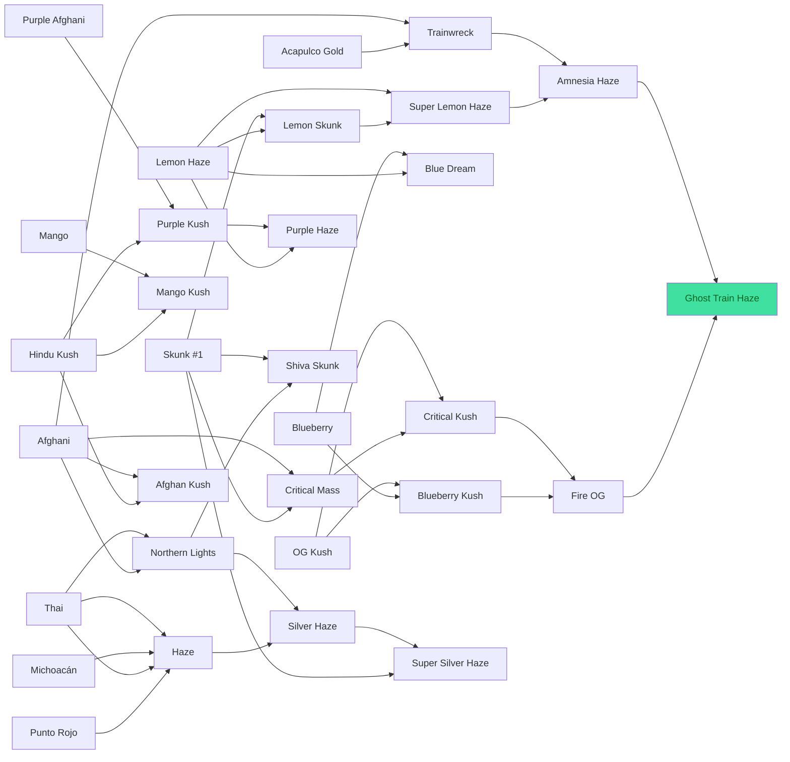

# Genética de Ribera Verde

> Generado automáticamente con `node tools/generar-docs.js` a partir de los datos del juego. No editar a mano: cambia `src/js/03-datos.js` y regenera.

## Las 41 variedades de la Genoteca

| # | Variedad | THC | Rinde (g/m²) | Días | Resist. | Tipo | Color | Cómo se consigue |
|---|---|---|---|---|---|---|---|---|
| 01 | Skunk #1 | 12% | 500 | 2,5 | 75% | línea estable | `#9bd35a` | Growshop (cap. 1), 5 € la semilla |
| 02 | Lemon Haze | 15% | 380 | 3,5 | 50% | polihíbrido (Lemon Skunk × Silver Haze) | `#d8e060` | Growshop (cap. 2), 9 € la semilla |
| 03 | OG Kush | 16% | 430 | 3 | 65% | polihíbrido (Chemdawg × Hindu Kush) | `#6fb04a` | Growshop (cap. 2), 10 € la semilla |
| 04 | Blueberry | 17% | 400 | 3,5 | 55% | línea estable | `#7a9ec8` | Growshop (cap. 3), 8 € la semilla |
| 05 | Mango | 15% | 560 | 3 | 60% | cruce F1 (KC 33 × Afghani) | `#b8c850` | Growshop (cap. 3), 7 € la semilla |
| 06 | Purple Afghani | 18% | 350 | 4 | 45% | línea estable | `#9070b8` | Growshop (cap. 4), 8 € la semilla |
| 07 | Afghani | 16% | 480 | 3 | 85% | landrace | `#88a050` | Kiko, al montar la mesa de genética: de un amigo de Mazar-i-Sharif (cap. 4) |
| 08 | Hindu Kush | 18% | 380 | 3 | 80% | landrace | `#4a8a3a` | Txaro, a cambio de 5 g para hacer aceite (parque): del viaje de su marido a Pakistán en 1976 |
| 09 | Acapulco Gold | 19% | 330 | 4,5 | 60% | landrace | `#d0c048` | En un bote de carrete escondido en un arbusto del parque (2,26), «Guerrero, 1979» |
| 10 | Malawi Gold | 20% | 300 | 5 | 55% | landrace | `#c8d068` | Iñaki, el marinero, tras venderle 10 g (muelle): de un marinero de Malaui en Mombasa |
| 11 | Lemon Skunk | 18% | 500 | 3 | 70% | cruce (F1 en la mesa) | `#c0dc50` | Cruce: Skunk #1 × Lemon Haze |
| 12 | Blueberry Kush | 20% | 450 | 3 | 65% | cruce (F1 en la mesa) | `#6a94b8` | Cruce: OG Kush × Blueberry |
| 13 | Trainwreck | 21% | 380 | 4 | 55% | cruce (F1 en la mesa) | `#a8cc58` | Cruce: Acapulco Gold × Afghani |
| 14 | Critical Mass | 21% | 500 | 3 | 85% | cruce (F1 en la mesa) | `#8cbc4c` | Cruce: Afghani × Skunk #1 |
| 15 | Purple Kush | 22% | 400 | 3,5 | 70% | cruce (F1 en la mesa) | `#7a5aa8` | Cruce: Hindu Kush × Purple Afghani |
| 16 | Mango Kush | 21% | 480 | 3,5 | 60% | cruce (F1 en la mesa) | `#a8c040` | Cruce: Mango × Hindu Kush |
| 17 | Blue Dream | 22% | 430 | 4 | 55% | cruce (F1 en la mesa) | `#80a8c0` | Cruce: Blueberry × Lemon Haze |
| 18 | Super Lemon Haze | 23% | 480 | 4 | 65% | cruce (F1 en la mesa) | `#d0e458` | Cruce: Lemon Skunk × Lemon Haze |
| 19 | Critical Kush | 24% | 530 | 3,5 | 80% | cruce (F1 en la mesa) | `#78ac44` | Cruce: Critical Mass × OG Kush |
| 20 | Purple Haze | 23% | 430 | 4 | 60% | cruce (F1 en la mesa) | `#8a64b0` | Cruce: Purple Kush × Lemon Haze |
| 21 | Amnesia Haze | 26% | 450 | 4,5 | 65% | cruce (F1 en la mesa) | `#bcd468` | Cruce: Super Lemon Haze × Trainwreck |
| 22 | Fire OG | 27% | 500 | 3,5 | 75% | cruce (F1 en la mesa) | `#90b448` | Cruce: Critical Kush × Blueberry Kush |
| 23 | Ghost Train Haze | 29% | 530 | 4,5 | 75% | cruce (F1 en la mesa) | `#d8ecb0` | Cruce: Amnesia Haze × Fire OG · **legendaria** |
| 24 | Michoacán | 15% | 380 | 4 | 55% | landrace | `#b8d860` | Banco de semillas del PC, sobre de 10 por 25 € (cap. 2; llega al día siguiente) |
| 25 | Punto Rojo | 16% | 380 | 4,5 | 45% | landrace | `#b4a24c` | Banco de semillas del PC, sobre de 10 por 30 € (cap. 2; llega al día siguiente) |
| 26 | Thai | 17% | 330 | 5 | 40% | landrace | `#b0d468` | Banco de semillas del PC, sobre de 10 por 30 € (cap. 2; llega al día siguiente) |
| 27 | Luang Prabang | 15% | 380 | 4,5 | 50% | landrace | `#8a9a5c` | Banco de semillas del PC, sobre de 10 por 40 € (cap. 4; llega al día siguiente) |
| 28 | Chitral Kush | 17% | 400 | 3 | 70% | landrace | `#7a9a48` | Banco de semillas del PC, sobre de 10 por 35 € (cap. 3; llega al día siguiente) |
| 29 | Nepalese | 16% | 350 | 3,5 | 65% | landrace | `#88906a` | Banco de semillas del PC, sobre de 10 por 30 € (cap. 3; llega al día siguiente) |
| 30 | Congolese | 16% | 400 | 3,5 | 55% | landrace | `#b4d058` | Banco de semillas del PC, sobre de 10 por 30 € (cap. 3; llega al día siguiente) |
| 31 | Lamb's Bread | 16% | 380 | 4 | 60% | landrace | `#a8d070` | Banco de semillas del PC, sobre de 10 por 30 € (cap. 3; llega al día siguiente) |
| 32 | Kif | 13% | 350 | 3 | 80% | landrace | `#a8c060` | Banco de semillas del PC, sobre de 10 por 20 € (cap. 2; llega al día siguiente) |
| 33 | Beldia | 12% | 300 | 3 | 75% | landrace | `#98b45c` | Banco de semillas del PC, sobre de 10 por 20 € (cap. 2; llega al día siguiente) |
| 34 | Oaxaca | 15% | 400 | 4 | 65% | landrace | `#b0a84a` | Banco de semillas del PC, sobre de 10 por 25 € (cap. 3; llega al día siguiente) |
| 35 | Panama Red | 17% | 350 | 4,5 | 50% | landrace | `#b8984c` | Banco de semillas del PC, sobre de 10 por 45 € (cap. 4; llega al día siguiente) |
| 36 | Haze | 20% | 400 | 5 | 45% | cruce (F1 en la mesa) | `#c8dc68` | Cruce: Punto Rojo × Thai (o Michoacán × Thai) |
| 37 | Northern Lights | 18% | 530 | 3 | 80% | cruce (F1 en la mesa) | `#7cae4c` | Cruce: Afghani × Thai |
| 38 | Afghan Kush | 19% | 500 | 3 | 85% | cruce (F1 en la mesa) | `#6e9a44` | Cruce: Afghani × Hindu Kush |
| 39 | Shiva Skunk | 19% | 550 | 3 | 85% | cruce (F1 en la mesa) | `#8cbc50` | Cruce: Northern Lights × Skunk #1 |
| 40 | Silver Haze | 21% | 450 | 4,5 | 55% | cruce (F1 en la mesa) | `#c0d880` | Cruce: Haze × Northern Lights |
| 41 | Super Silver Haze | 23% | 500 | 4 | 70% | cruce (F1 en la mesa) | `#c8e090` | Cruce: Silver Haze × Skunk #1 |

## Historia de cada variedad

Las landraces y los híbridos clásicos de la 1.9 salen del catálogo de Strainmon (`../src/species.js`): mismas regiones y perfiles, con su nombre real. Se lee en la Genoteca.

| Variedad | Origen | Historia |
|---|---|---|
| Michoacán | Landrace · altiplano de Michoacán, México | Sativa de altura, espigada y cerebral. Aguanta bien el sol fuerte. |
| Punto Rojo | Landrace · cordillera de Colombia | Sativa colombiana de pistilos rojizos. Floración larga y efecto eufórico. |
| Thai | Landrace · selvas del norte de Tailandia | Sativa esbelta, de floración larguísima y aroma especiado. Es madre de la Haze y de la Northern Lights. |
| Luang Prabang | Landrace · montes del norte de Laos | Sativa de las tierras altas de Laos. Muy vigorosa, con aroma dulce y a madera. |
| Chitral Kush | Landrace · valle de Chitral, Pakistán | Índica de charas: su resina se frota a mano. Puede salir con tonos morados. |
| Nepalese | Landrace · colinas del Himalaya, Nepal | Planta de altura, compacta y resinosa, con aroma a incienso. |
| Congolese | Landrace · cuenca del Congo | Sativa africana rápida para su tipo. Efecto claro y aroma a fruta ácida. |
| Lamb's Bread | Landrace · costa de Jamaica | Sativa caribeña que tolera la brisa salina. Aroma dulce, tropical y marino. |
| Kif | Landrace · montañas del Rif, Marruecos | La planta del hachís marroquí: seca, compacta y cargada de tricomas. |
| Beldia | Landrace · Ketama, en el Rif | La vieja landrace del Rif, casi desplazada por los híbridos. Rústica y aromática. |
| Oaxaca | Landrace · sierra de Oaxaca, México | Sativa de suelo volcánico, vigorosa, con aroma ahumado y terroso. |
| Panama Red | Landrace · istmo de Panamá | La sativa legendaria de los setenta, veteada de rojo. Muy cerebral y de floración lenta. |
| Haze | Punto Rojo × Thai (o Michoacán × Thai) | Se estabilizó en California a finales de los sesenta con sativas de Colombia, México, Tailandia y el sur de la India. |
| Northern Lights | Afghani × Thai | Índica estabilizada en el noroeste de EE. UU. y fijada en Holanda en los ochenta. Compacta y muy resinosa. |
| Afghan Kush | Afghani × Hindu Kush | Las dos índicas de montaña juntas: compacta, resinosa y de floración corta. |
| Shiva Skunk | Northern Lights × Skunk #1 | Northern Lights con Skunk #1: robusta, rápida y muy productiva. |
| Silver Haze | Haze × Northern Lights | La Haze domada con Northern Lights: conserva el efecto y acorta la floración. |
| Super Silver Haze | Silver Haze × Skunk #1 | Haze, Northern Lights y Skunk #1 en una sola línea. Una de las sativas más premiadas de los noventa. |

## Recetas de cruce (20)

El orden de los padres da igual. Cada cruce gasta 1 semilla de cada padre y da 2 semillas del resultado.

| Madre | Padre | Resultado | THC |
|---|---|---|---|
| Lemon Haze | Skunk #1 | **Lemon Skunk** | 18% |
| Blueberry | OG Kush | **Blueberry Kush** | 20% |
| Acapulco Gold | Afghani | **Trainwreck** | 21% |
| Skunk #1 | Afghani | **Critical Mass** | 21% |
| Hindu Kush | Purple Afghani | **Purple Kush** | 22% |
| Hindu Kush | Mango | **Mango Kush** | 21% |
| Lemon Haze | Blueberry | **Blue Dream** | 22% |
| Lemon Skunk | Lemon Haze | **Super Lemon Haze** | 23% |
| Critical Mass | OG Kush | **Critical Kush** | 24% |
| Lemon Haze | Purple Kush | **Purple Haze** | 23% |
| Super Lemon Haze | Trainwreck | **Amnesia Haze** | 26% |
| Blueberry Kush | Critical Kush | **Fire OG** | 27% |
| Fire OG | Amnesia Haze | **Ghost Train Haze** | 29% |
| Punto Rojo | Thai | **Haze** | 20% |
| Michoacán | Thai | **Haze** | 20% |
| Afghani | Thai | **Northern Lights** | 18% |
| Hindu Kush | Afghani | **Afghan Kush** | 19% |
| Northern Lights | Skunk #1 | **Shiva Skunk** | 19% |
| Haze | Northern Lights | **Silver Haze** | 21% |
| Skunk #1 | Silver Haze | **Super Silver Haze** | 23% |

## Árbol hasta la Ghost Train Haze

## Estabilizar (F1 → estable)

Lo que sale de un cruce nuevo (receta o híbrido propio) es una **F1**: una línea inestable en la que cada planta sale distinta.

- En la mesa de genética, al elegir como padre la misma variedad («· estabilizar»), se cruzan dos plantas de la línea: gasta 2 semillas, guarda 1 y sube una generación (F1 → F2 → F3 → **estable** en la F4). Entre generaciones hay que cultivar la línea para tener otra vez 2 semillas.
- Una línea sin fijar la estás criando: sus plantas se polinizan entre ellas y cada una da 2-5 semillas al cosecharla (las demás: las de tienda son feminizadas y casi nunca dan, 12 % de que una flor hermafrodita deje 1-3; las landraces (como el Afghani que te da Kiko) y tus líneas ya fijadas son regulares y algún macho poliniza unas flores: 1-3 por planta).
- Las landraces y las de la tienda llevan su tipo genético (abajo); las de receta, estabilizadas, son líneas estables.

## Fenotipos (1.10)

Cada semilla es una planta distinta. Al germinar, tira su fenotipo: THC × (1 + σ·z) y gramos × (1 + σ·z), cada uno por su lado (z normal; entre ×0,6 y ×1,5). σ depende de lo pura que sea la genética. Si THC × gramos ≥ 1,35, es un **fenotipo estrella**: va a un lote aparte (★) que se vende y se presenta a la Copa por separado. Si ≤ 0,75, es **floja**. El fenotipo se sabe al cosecharla.

| Tipo | σ | Estrella | Qué es |
|---|---|---|---|
| Línea estable | 0,06 | 1 de cada ~16.000 | fijada a lo largo de generaciones: casi todas las plantas salen iguales |
| Cruce F1 | 0,07 | 1 de cada ~2.000 | hijo directo de dos líneas estables: uniforme y con vigor híbrido |
| F1 | 0,08 | 1 de cada ~500 | línea inestable, cosechas desiguales. Estabilízala en la mesa |
| F2 | 0,12 | 1 de cada ~40 | línea inestable, la generación que más se separa. Estabilízala en la mesa |
| F3 | 0,1 | 1 de cada ~100 | línea inestable, ya seleccionada. Estabilízala en la mesa |
| Landrace | 0,1 | 1 de cada ~100 | población silvestre de su región: plantas variadas |
| Polihíbrido | 0,11 | 1 de cada ~60 | cruce de cruces: cada planta sale distinta |

Con 50 semillas de un polihíbrido sale de media casi 1 estrella (58 % de que salga al menos una); con 50 de una línea estable, casi nunca. `test-historia` tira 200.000 plantas de cada tipo y comprueba esas tasas.

**Esquejes:** a una planta en crecimiento (20-65 %) se le saca un esqueje (−5 de salud): es la misma planta, con su fenotipo. Enraíza en el propagador (hasta 12) y hay que plantarlo antes de que acabe el día siguiente (1 día de juego ≈ 4 semanas); entra ya de plántula (12 %). Cuando cosechas la madre o un clon y sale estrella, sus esquejes se marcan con ★: así se guarda un fenotipo.

## Híbridos propios (cruces sin receta)

Cualquier pareja que no esté en la tabla de recetas genera un híbrido «propio», determinista (la misma pareja da siempre el mismo resultado) y guardado en `S.custom`:

- **Nombre:** primera palabra de la madre + última palabra del padre (si coincide con un padre, al revés; si ya existe, se añade «F2…F8»).
- **THC:** media de los padres + aleatorio entre −1,5 y +2,0 (tope 33 %).
- **Rendimiento:** media ± 4 g. **Días:** media ± 0,3 (redondeado a medios días). **Resistencia:** media ± 5 (entre 20 y 95).
- **Color:** mezcla al 50 % de los colores de los padres.
- Aparecen en la Genoteca con ★ y cuentan para el objetivo de «descubrir 8 variedades».

## Fórmulas de cultivo

- **Crecimiento por hora:** `1 / (días × 24) × crec`, ×0,4 si el agua < 20 %, 0 si el agua llega a 0, ×1,1 con abono. `crec`, `thc` y `riego` salen del foco (a plena intensidad desde 400 W/m²) y de la maceta de cada plaza. Equipo, precios y luz: [ECONOMIA.md](ECONOMIA.md).
- **Agua:** baja 3,5 × riego puntos por hora (con CFL y maceta de 7 L una planta regada aguanta ~28 h).
- **Salud:** −4/h sin agua, −2,5/h con plaga, +1/h si agua > 30 % y sin plaga. A 0 la planta muere.
- **Plagas:** probabilidad por hora `0,006 × (100 − resistencia) / 40` mientras no está madura.
- **Cosecha (g):** `mín(tope de la maceta, W × g/W ÷ plazas de la carpa × rend de la maceta × rinde/34 × (0,4 + 0,6 × salud/100) × (abono ? 1,25 : 1) × fenotipo)`. Una plaza vacía es luz perdida.
- **THC final:** `THC × fenotipo × (0,85 + 0,15 × salud/100) + thc del foco + (abono ? 0,3 : 0)` (tope 35 %).
- **Rinde (g/m²) de la tabla:** lo que daría con un LED a 400 W/m², abonada y sana.
